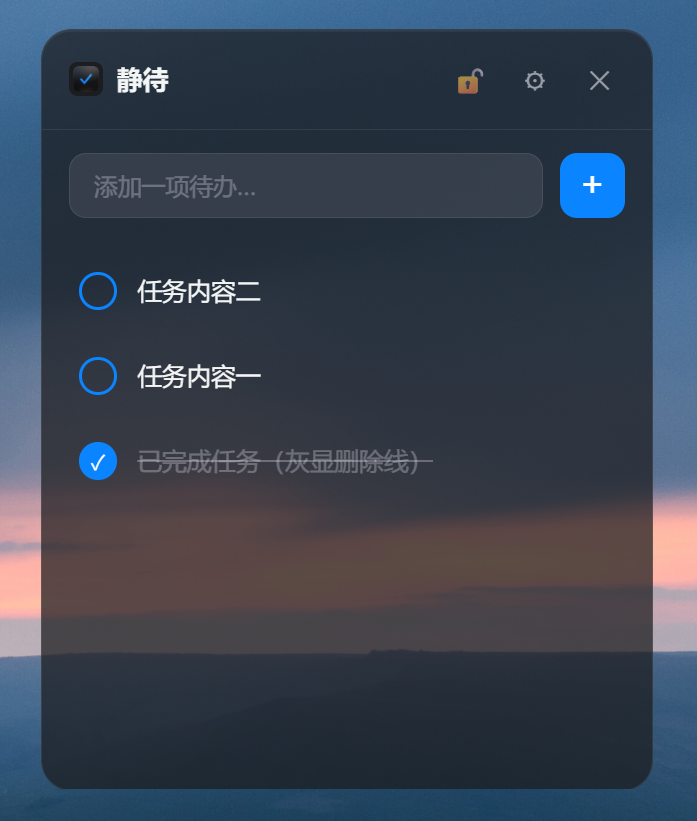

<div align="center">


# 静待 QuietDo —— 极简桌面悬浮待办

一款常驻 Windows 桌面的 Apple 风格悬浮待办小组件。打开即用、纯本地、无账号、不打扰。

**[下载安装包](https://github.com/LuvKobe/quietdo/releases)** —— 下载即用，无需配置

[](https://github.com/LuvKobe/quietdo/actions/workflows/release.yml)
[](LICENSE)

</div>

---

## 这是什么

一个安静停留在桌面角落的待办小挂件：深色半透明毛玻璃窗口，只做「记录 → 完成 → 删除」三件事。

和常见待办应用的几个不同：

- **纯本地，零联网** —— 任务与设置只存本机 JSON 文件，不上传、不登录、无账号、无广告
- **桌面悬浮挂件形态** —— 无边框透明窗口，始终置顶，可拖动、可缩放、可锁定位置
- **Apple 设计语言** —— 毛玻璃质感、大圆角、系统蓝强调、iOS 风格开关与滑块
- **极简克制** —— 不做分组、标签、提醒、多视图，专注把当下的事记下来、勾掉
- **轻量** —— 基于 Tauri，安装包仅几 MB，内存占用低，冷启动快

## 功能

- **添加任务** —— 输入框回车或点加号，新任务出现在列表顶部，自动清空并回焦，便于连续录入
- **勾选完成** —— 点圆圈切换完成态，文字灰显加删除线并保留在原位；再次点击取消
- **编辑任务** —— 双击任务文字进入行内编辑，回车或失焦保存，Esc 取消
- **删除任务** —— 悬停显示垃圾桶，点击即删，无二次确认（直接物理删除，不保留副本）
- **数据持久化** —— 所有增/删/改/勾选/设置即时写入本地文件，重启后任务、透明度、窗口位置全部恢复
- **拖动移动** —— 按住标题栏拖动窗口到桌面任意位置
- **调整大小** —— 拖动窗口四边或四角自由缩放，任务多或长时可拉大
- **锁定位置** —— 标题栏锁定按钮，锁定后禁止拖动与缩放，防止误触
- **透明度调节** —— 设置面板滑块实时调节整窗透明度（30%–100%）
- **显示/隐藏标题栏** —— 一键切换更极简的窗口形态
- **窗口置顶开关** —— 可切换是否始终悬浮于其他窗口之上，默认关闭，不打扰
- **开机自启** —— 一键注册/移除 Windows 开机自动启动
- **最小化到托盘** —— 标题栏 — 按钮收进系统托盘后台运行，首次带提示；✕ 直接退出
- **系统托盘** —— 托盘常驻图标，左键显示窗口，右键菜单「显示/隐藏」「退出」

## 界面

深色半透明毛玻璃悬浮窗，自上而下分为标题栏、输入区、任务列表三部分：

<div align="center">

<br>



</div>

## 技术栈

- **框架** [Tauri 2](https://tauri.app/)（Rust 内核 + 系统 WebView2 渲染）
- **前端** 原生 HTML / CSS / JavaScript，无框架
- **后端** Rust，通过自定义命令暴露本地文件读写与窗口控制
- **插件** `tauri-plugin-autostart`（开机自启）、`tauri-plugin-window-state`（窗口位置记忆）
- **存储** 本地 JSON 文件，无数据库

窗口为无边框透明置顶设计，拖动与缩放通过 `start_dragging` / `start_resize_dragging` 调用系统能力实现。

## 数据与隐私

数据 100% 保存在本地，存放于用户配置目录 `%APPDATA%/com.quietdo.app/`：

- `todos.json` —— 任务数组，每条含 `id`、`text`、`done`
- `config.json` —— 外观与窗口配置（透明度、标题栏显隐、窗口置顶、开机自启、锁定；窗口位置与大小由 window-state 插件单独记忆）

应用不发起任何网络请求，卸载后删除上述目录即可清除全部数据。

## 快速开始（开发）

需要 [Node.js](https://nodejs.org/)（建议 18+）与 [Rust](https://rustup.rs/)（stable，MSVC 工具链）。
Windows 还需 **Microsoft C++ Build Tools**（含「使用 C++ 的桌面开发」工作负载）与 **WebView2 运行时**（Win10/11 一般已内置）。

```bash
git clone https://github.com/LuvKobe/quietdo.git
cd quietdo
npm install
npm run tauri dev      # 启动开发窗口（首次会编译 Rust 依赖，稍慢）
```

## 构建打包

```bash
npm run tauri build    # 生成当前平台安装包（.msi / .exe）
```

产物位于 `src-tauri/target/release/bundle/` 下。

如需替换应用图标，把源图放好后运行：

```bash
npm run tauri icon 你的图标.png
```

## 发布（GitHub Actions）

仓库已配置 `.github/workflows/release.yml`：推送形如 `v1.0.0` 的 tag 即自动在 Windows 上编译、打包并创建 GitHub Release。

```bash
git tag v0.1.0
git push origin v0.1.0
```

工作流跑完后，安装包会出现在 [Releases](https://github.com/LuvKobe/quietdo/releases) 的对应版本中（默认先创建草稿 Release，确认后手动 Publish）。

> 首次运行未签名安装包时，Windows SmartScreen 可能提示「未知发布者」，点「更多信息 → 仍要运行」即可；如需消除该提示需自购代码签名证书。

## 目录结构

```
quietdo/
├─ src/                       # 前端
│  ├─ index.html              # 界面结构
│  ├─ styles.css              # Apple 风格样式
│  └─ main.js                 # 交互逻辑（调用 Rust 命令）
├─ src-tauri/                 # Tauri / Rust 后端
│  ├─ src/lib.rs              # 本地存储、窗口拖动/缩放/关闭、开机自启命令
│  ├─ tauri.conf.json         # 窗口与打包配置
│  ├─ Cargo.toml              # Rust 依赖
│  └─ icons/                  # 应用图标
└─ .github/workflows/release.yml   # 打包发布工作流
```

## 明确不做

为保持极简，以下功能刻意不实现：

- 账号 / 登录 / 云同步
- 多清单 / 分组 / 标签
- 今天 / 计划 / 重要等多视图
- 截止日期 / 提醒 / 重复任务
- 子任务 / 优先级 / 搜索

## 许可证

[MIT](LICENSE)
